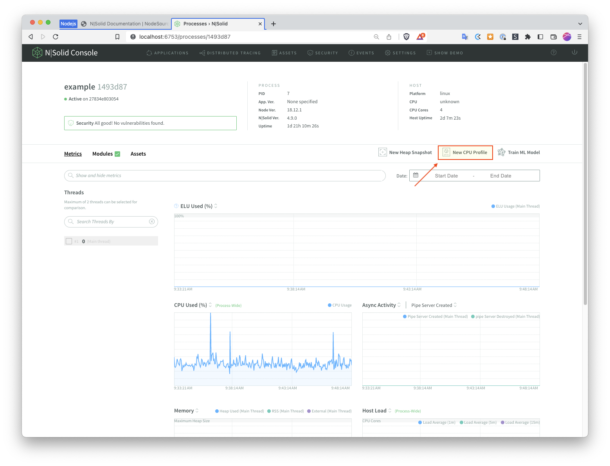

# Connect a Nodejs Application to N|Solid for Performance Monitoring Purposes

- [Connect a Nodejs Application to N|Solid for Performance Monitoring Purposes](#connect-a-nodejs-application-to-nsolid-for-performance-monitoring-purposes)
  - [Summary](#summary)
  - [Goal](#goal)
  - [Prerequisites](#prerequisites)
  - [Getting Started](#getting-started)
  - [Using N|Solid for CPU Profiling](#using-nsolid-for-cpu-profiling)
    - [Send traffic to your application](#send-traffic-to-your-application)
    - [Create your first CPU Profile](#create-your-first-cpu-profile)
  - [Conclusion](#conclusion)

## Summary 

_[N|Solid](https://bit.ly/3YwaMA7)_ _"provides live instrumentation of your production system's health, and stability with no changes to your application code."_ With an Enterprise license, _N|Solid_ enables real-time CPU and memory profiling capabilities, as well as active monitoring of any security vulnerabilities in production Nodejs modules or NPM dependencies. In development environments, _N|Solid_ can be leveraged to "stress test" applications running up to four (4) processes to identify CPU or memory performance issues at no cost. 

---

## Goal 

This project demonstrates how to run any Nodejs application with the _[N|Solid Runtime](https://docs.nodesource.com/nsolid/4.9/docs#nsolid-runtime)_ and connect it to the _[N|Solid Console](https://docs.nodesource.com/nsolid/4.9/docs#nsolid-console)_ via `docker-compose` with the goal of identifying CPU or memory performance issues in the application.

---

## Prerequisites 

* [Docker Desktop](https://www.docker.com/products/docker-desktop/)
* A free [Nodesource](https://accounts.nodesource.com/sign-up) account

---

## Getting Started

After creating your free _Nodesource_ account, you can navigate to the [Licensing](https://accounts.nodesource.com/general) page on the _Nodesource_ website. Here you can collect your _N|Solid_ "License Key", and run the following command in your terminal: 

```
export NSOLID_CONSOLE_LICENSE_KEY=<YOUR_LICENSE_KEY>
```

At this point, you're ready to run the _[N|Solid Console](https://docs.nodesource.com/nsolid/4.9/docs#nsolid-console)_ alongside the provided sample application via `docker-compose`

_Note: The [N|Solid Documentation](https://docs.nodesource.com/nsolid/4.9/docs#docker) for running via `docker-compose` proposes using separate `yaml` files for the N|Solid Console and the sample application. This project, however, simplifies the two components into one yaml file, and obviates the need to independently run the `docker network create` command._

You can start the _N|Solid Console_ application via `docker-compose` with the following command:

```
docker-compose up -d
```

At which point, you can navigate to the _N|Solid Console_ at [http://localhost:6753](http://localhost:6753)

---

## Using N|Solid for CPU Profiling

While [_N|Solid_ Documentation](https://docs.nodesource.com/nsolid/4.9/docs#console-overview) covers everything there is to know about using the _N|Solid_ Console, these instructions will just go over how to create your first CPU Profile with _N|Solid_.

### Send traffic to your application

Naturally, to see where your application is using the most CPU, you'll need to send traffic to the application in one way or another. If an application has unit tests, running them repeatedly would be a good place to start. For the sake the example application provided with this project, you can run it repeatedly with the following command:

```
while sleep 1; do
    curl -s localhost:8888 &>/dev/null && echo -e "\e[1A\e[KApplication ran at $(date '+%F %H:%M:%S')"
done
```

### Create your first CPU Profile

* Click on the name of your project, e.g. _example_


* Click on _CPU Anomaly Detection_


* Click on the process id of the running process


* Click on _New CPU Profile_


* Select the time duration and "View" of your choice; The view can be changed after the fact when viewing the CPU Profile


* When the profile is ready, click _View Profile_ on the top of the screen


* Scroll over CPU Profile graph to inspect


---

## Conclusion

At this point, you should be up and running with _N|Solid_ and able to explore its features. A good next step would be to replace the `example` application with your own and begin producing CPU Profiles. 